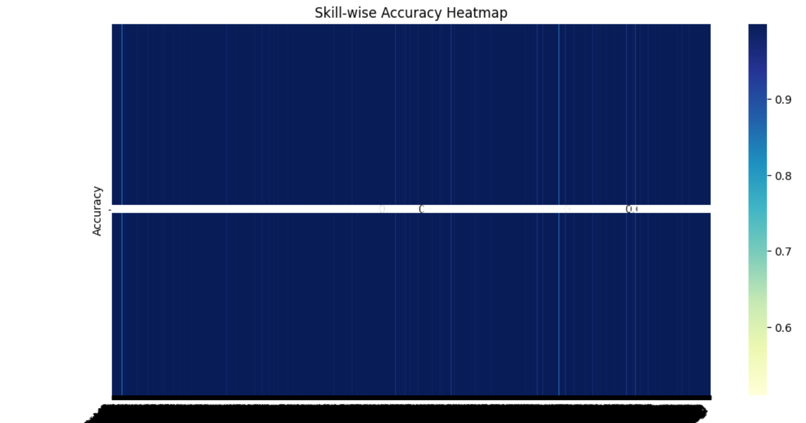

SkillLink recommends the most relevant skills for a user based on their current skills, desired job title, and industry. It uses TF-IDF text embeddings and a multi-label Keras model trained on job descriptions + skill sets. The project includes preprocessing, model training, prediction, visualization (accuracy & loss graphs, skill-wise heatmap), and a logging system that appends every prediction to persistent CSV and JSON history files.

This README documents how to set up, run, and extend the repository you already created at:

C:\Users\NXTWAVE\Downloads\Job Skill Recommendation

Contents / file structure (what the repository expects)
Job Skill Recommendation/
├─ archive/
│  └─ all_job_post.csv              # original dataset used for training
├─ tfidf_vectorizer.pkl             # created after running training
├─ mlb.pkl                          # MultiLabelBinarizer saved after training
├─ skill_model.keras                # trained Keras model (native format)
├─ skill_model.h5                   # optional legacy Keras model
├─ skill_model.pkl                  # optional pickled model object
├─ skill_model.json                 # model architecture JSON
├─ skill_recommendation_history.csv # CSV log (appended each prediction)
├─ skill_recommendation_history.json# JSON log (appended each prediction)
├─ train_and_save.py                # full training pipeline (provided)
├─ visualize.py                     # plotting scripts (accuracy, heatmap)
├─ predict_and_append.py            # prediction + append-to-history script
└─ README.md                        # this file

Prerequisites

OS: Windows (paths in examples use Windows)

Python 3.8+ (you used Python 3.11)

Recommended RAM: ≥8GB for training with large datasets

GPU optional (TensorFlow will use it if available)

Python packages

Install required packages in a virtualenv or conda env:

python -m venv venv
venv\Scripts\activate
pip install --upgrade pip
pip install pandas numpy scikit-learn tensorflow matplotlib seaborn nltk pyyaml

If you prefer conda:

conda create -n skilllink python=3.11
conda activate skilllink
pip install pandas numpy scikit-learn tensorflow matplotlib seaborn nltk pyyaml

NLTK data (first run)

Your scripts call nltk.download('stopwords') and nltk.download('wordnet'). To download manually:

import nltk
nltk.download('stopwords')
nltk.download('wordnet')

Quick start — Files you already have

You mentioned these columns in the CSV:

['job_id', 'category', 'job_title', 'job_description', 'job_skill_set']

The provided scripts rely on job_description + job_skill_set for training and TF-IDF construction.

How to run (training pipeline)

Place the dataset in:

C:\Users\NXTWAVE\Downloads\Job Skill Recommendation\archive\all_job_post.csv

Run the training file (example name train_and_save.py). This will:

Preprocess text (lowercase, remove punctuation, stopword removal, lemmatize)

Fit TF-IDF on job_description + job_skill_set

Train a simple feedforward multi-label Keras model

Save artifacts: tfidf_vectorizer.pkl, mlb.pkl, skill_model.keras, skill_model.h5, skill_model.pkl, skill_model.json

python train_and_save.py

Key parameters inside train_and_save.py:

TFIDF max_features — default 5000; can be raised/lowered for capacity/perf.

model.fit(epochs=...) — increase epochs for better training.

validation_split — default 0.1 in example.

How to run prediction & append results

Use the supplied predict_and_append.py (this is the full script that appends to history):

python predict_and_append.py

By default, the script contains an example HR input:

user_skills_input = ["communication", "recruitment", "employee relations"]
job_title_input = "HR Manager"
industry_input = "Human Resources"

It will:

Preprocess the input

Vectorize with the saved TF-IDF

Run model.predict(...) and threshold probabilities (default 0.5)

Produce top-N recommended skills

Append a row to:

skill_recommendation_history.csv (CSV, lists JSON-encoded)

skill_recommendation_history.json (JSON array)

You can integrate predict_and_append.predict_and_save(...) into a web app (Gradio/Streamlit) to call per session.

Output format (history files)

CSV: skill_recommendation_history.csv — each row is a prediction record. Fields:

timestamp, user_current_skills (JSON string), target_job_title, target_industry, recommended_skills (JSON string)

JSON: skill_recommendation_history.json — array of objects; each object contains the above fields.

CSV stores the lists as JSON strings to allow easy parsing later using json.loads.

Visualization (accuracy & heatmap)

If you trained the model with history = model.fit(...) and saved history, run visualize.py to produce:

Training vs validation accuracy graph

Training vs validation loss graph

Skill-wise accuracy heatmap (skill → fraction correct)

Example usage:

python visualize.py

Tip: For very large numbers of skills (columns from mlb.classes_), show the top-K skills by accuracy to make the heatmap readable:

top_k = 20
top_idx = np.argsort(skill_acc)[-top_k:]

Configuration & frequently used settings

THRESHOLD for converting probabilities to binary predictions — default 0.5. Lower threshold → more skills recommended.

TOP_N — number of top skills to return in recommend_skills(...).

TFIDF max_features — higher gives more expressive vectors (use memory accordingly).

EPOCHS — increase for better accuracy; add callbacks (EarlyStopping/ReduceLROnPlateau) for robustness.

Troubleshooting & notes

KeyError: 'skills' — dataset column name mismatch. Use print(df.columns) to verify. This repo expects job_skill_set.

Keras YAML error — model.to_yaml() is removed. Use .to_json() and .save(... .keras). The code uses .keras format.

Large dataset memory errors — if X_tfidf.toarray() is too large, avoid converting sparse matrix to dense. Use models that accept sparse input (e.g., scikit-learn multilabel classifiers) or use partial_fit methods / minibatch training or reduce TF-IDF dimensions.

NLTK downloads fail — make sure environment has internet and proper write permissions to the NLTK data folder.

Performance improvements:

Use pretrained transformers (BERT) embeddings for semantic similarity. That requires additional compute.

Replace the simple dense model with a lightweight classifier per skill (one-vs-rest) using sklearn if memory is a concern.

History scaling: If the JSON history grows large, consider NDJSON (one JSON object per line) for streaming append and read performance.

Extending the project

Gradio/Streamlit UI: interactive input (skills, job title, industry) and show:

recommended skills with relevance scores

skill gap analysis vs aggregated job postings for the target job

trending skills chart (monthly demand)

Web scraping pipeline: add a module to scrape/ingest LinkedIn / Indeed job posts to update trends (be mindful of TOS).

Trending alerts: run scheduled scrapers to compute monthly deltas and email/notify users.

Use Transformer embeddings: replace TF-IDF with sentence-transformers for semantic matching and improved recommendations.

Collaborative filtering: if you collect user-skill historical data or ratings, add a CF layer to suggest skills based on similar users.

Example (HR prediction) — expected sample output

When running predict_and_append.py with HR example:

{
  "timestamp": "2025-09-21 19:18:00",
  "user_current_skills": ["communication", "recruitment", "employee relations"],
  "target_job_title": "HR Manager",
  "target_industry": "Human Resources",
  "recommended_skills": [
    "talent acquisition",
    "onboarding",
    "performance management",
    "payroll",
    "training and development",
    "conflict resolution",
    "strategic hr planning",
    "compliance",
    "employee engagement",
    "hr analytics"
  ]
}

This record will be appended to both CSV and JSON history files.
